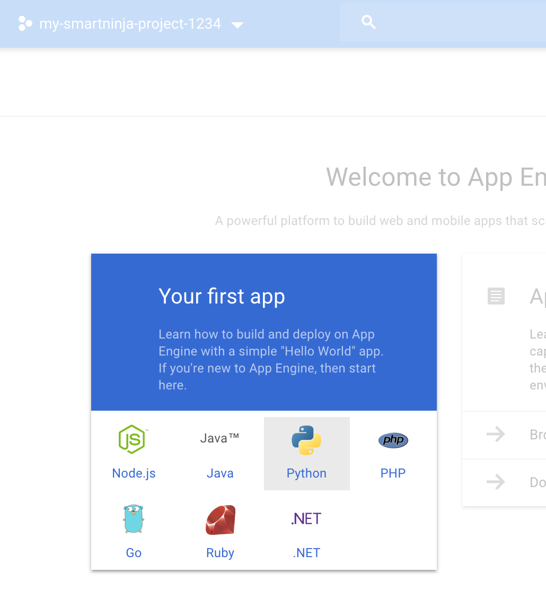
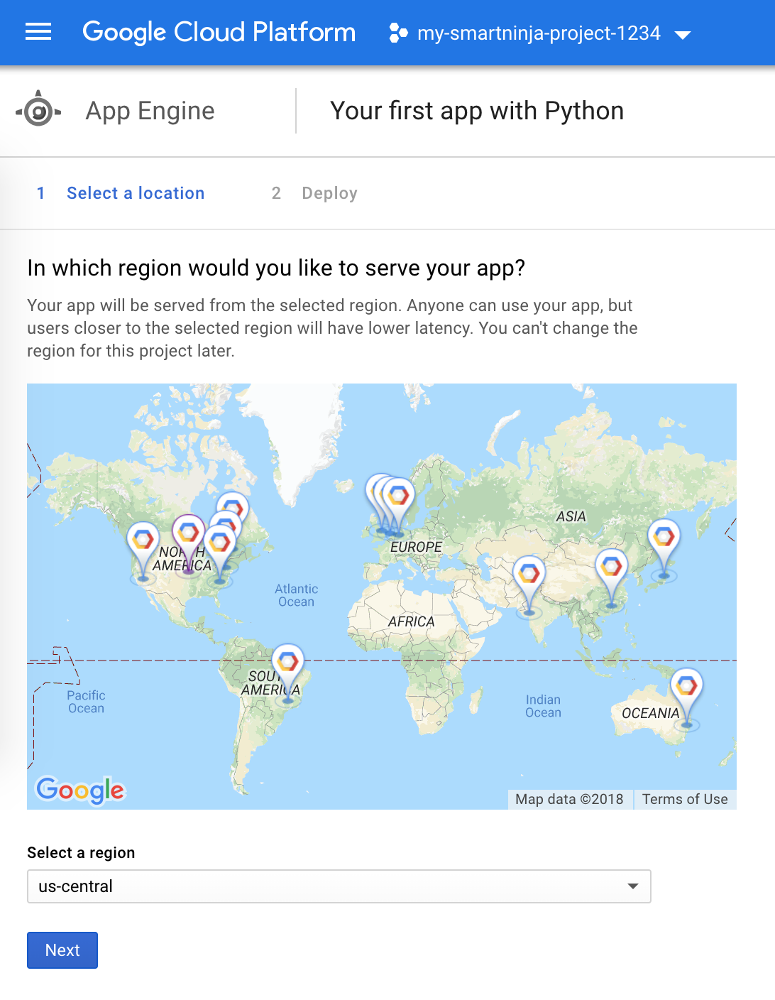
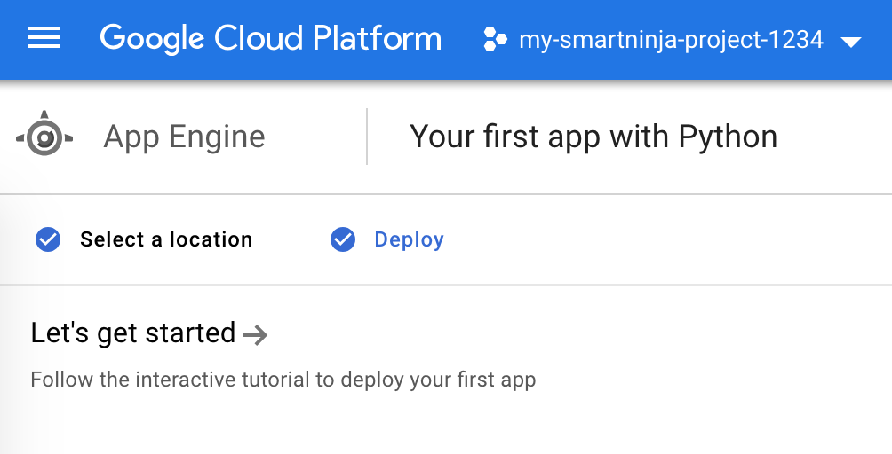
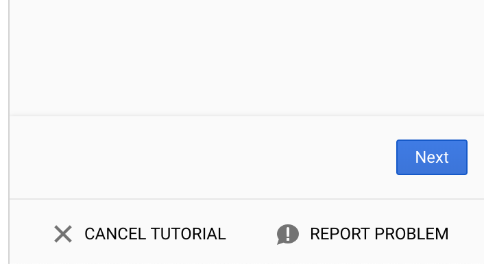
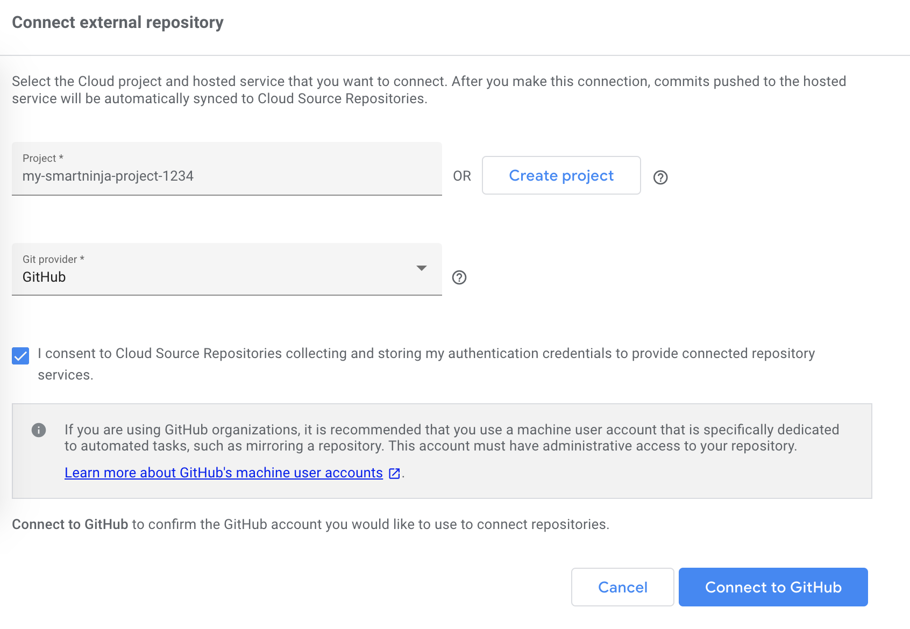
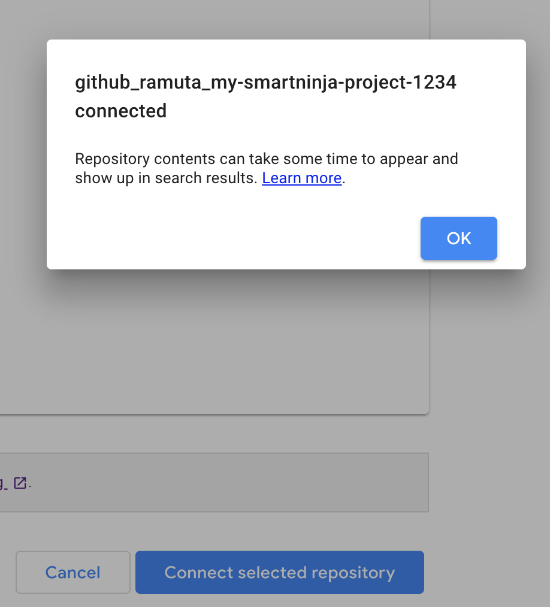
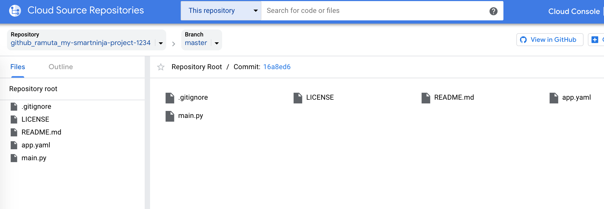

# How to deploy your Flask web app to Google Cloud via GitHub

This tutorial will show you how to **deploy** your Flask web app to Google App Engine (GAE) via **GitHub**.

## When does that come in handy?

This is useful if the **Cloud SDK does not work** on your computer, so you can't deploy to Google Cloud using that SDK.

Instead, you can **connect** your **Google Cloud** account to your **GitHub** account and every time you push your code to GitHub, you'll be able to deploy your project directly to Google Cloud.

Let's see how this works step-by-step.

## Prerequisites

You'll need to have a GitHub account and a Google (Gmail) account.

The tutorial also assumes that you have a Flask web app already created. The one thing you need to add to your Flask project is the `app.yaml` file.

Create the `app.yaml` file and add this code in it:

```
runtime: python37

handlers:
- url: /static
  static_dir: static
- url: /.*
  script: auto
```

This code basically says that your project needs Python 3.7 and that the `static` folder should be accessible via the `/static` URL.

Make sure to push your code to GitHub.

So now we can proceed with setting up our Google Cloud hosting.

## Step 1: Create Google Cloud project

> Before you start, make sure you already have your web app code on GitHub.

Log into the [Google Cloud Console](https://console.cloud.google.com/) and create a new project:


Use a **unique** name. I used: **my-smartninja-project-1234**.

**Wait** for Google Cloud to finish creating the project (you'll see a spinning wheel on the **top right side** of the **navigation bar**).

## Step 2: Open the project

When the project is created, you need to **open** it. Use the **search window** in the navigation bar. Enter the name of your project in it and click on it.


## Step 3: Enable App Engine

When your project is opened, you need to enable App Engine for it. Head **back to search** and type in "App Engine" and click on **App Engine**:


## Step 4: Create a GAE Python app

Click on **"Your first app"** and select **Python**:



## Step 5: Choose the server region

Choose the **servers region** where you want your web app to be hosted. Usually you'd choose the region closest to you, but in our case **choose only between these two regions**:

- us-east1
- europe-west3

Why only one of these two? Because we will use Firestore database later in the course and for now Firestore is only available for GAE apps in these two regions.



(don't mind that the "us-central" is selected in this image. Select either `us-east1` or `europe-west3` instead!)

## Step 6: Wait while Google Cloud prepares GAE

Wait while Google Cloud is preparing your Google App Engine app:


## Step 7: Skip the GAE tutorial

You'll be then offered to go through the GAE tutorial, but cancel it.





## Step 8: GIT repositories on Google Cloud

The next step is to **create** a GIT repository on Google Cloud. Later you'll **connect** this repository to your GitHub repository.

Go to the search windows and enter "Repo":


Click on **Source Repositories**.

## Step 9: Add new repository

Click on **Add new repository**:


## Step 10: Connect external repository

Then select **Connect external repository** and click **Continue**:


## Step 11: Connect to GitHub

Under **Git provider** choose GitHub, check the checkbox and click on **Connect to GitHub**:



Next, a **dialog window** will open where you'll need to **log into GitHub** (if you're not already) and then **confirm** the connection between Google Cloud and GitHub.

## Step 12: Select your GitHub repository

When the connection is made, a **window** with your GitHub repositories will appear. **Choose the one** you'd like to connect with your Google Cloud project:


## Step 13: Connect the selected repository

Click on the **Connect selected repository** button and if everything went okay, you'll see the following popup:



## Step 14: Google Cloud repository

A **new page** with your Google Cloud repository will open. It will have the code from GitHub in it:



## Step 15: Open Cloud shell

Now you have to **deploy** this web app code from the Google GIT repository to Google App Engine. You'll do it via a **Terminal** (shell) which is **built into** the Google Cloud Console.

Click on **Open in Cloud Shell** button (if you can't find it, try to find its icon in the navigation bar):


## Step 16: gcloud app deploy

A terminal window will appear (in the bottom of the screen). Enter `gcloud app deploy app.yaml` in it:


When it asks you "Do you want to continue?" enter: **Y**.


## Step 17: Check your website

**Congrats!** Your web app has been **deployed** to Google Cloud!

You can see it by going to the URL that you can see under **target url** (see the previous image). Or if you enter `https://your-app-id.appspot.com` in your browser. In my case it was `https://my-smartninja-project-1234.appspot.com` (this link is not active anymore).

## Step 18: Updating the code

Whenever you update the code, you have to do the following (in order to see the changes on your website):

- Upload the code to GitHub.
- Go to Google Cloud Console, open your project and open the Cloud Shell (Terminal), like in step 15.
- Enter `git pull origin master` in the Cloud Shell. This will pull the changes from GitHub to your Google Cloud repository.
- Deploy the code to GAE using this command (enter in the Cloud Shell): `gcloud app deploy app.yaml` (the same as step 16).